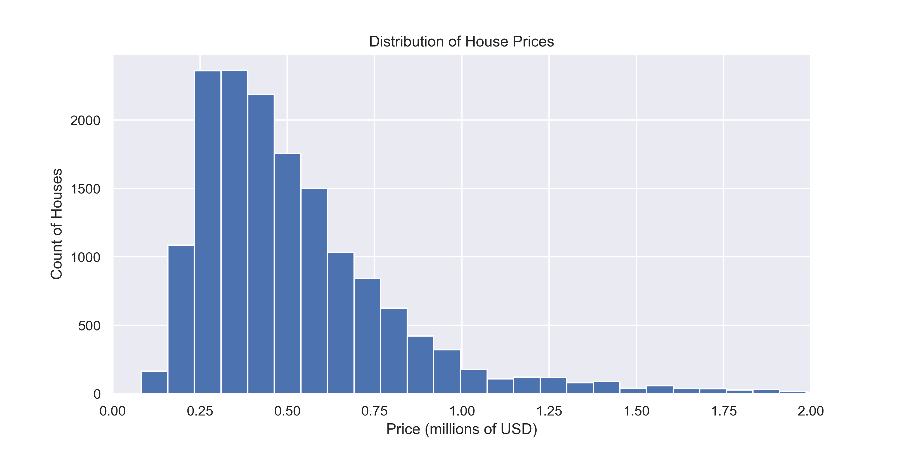
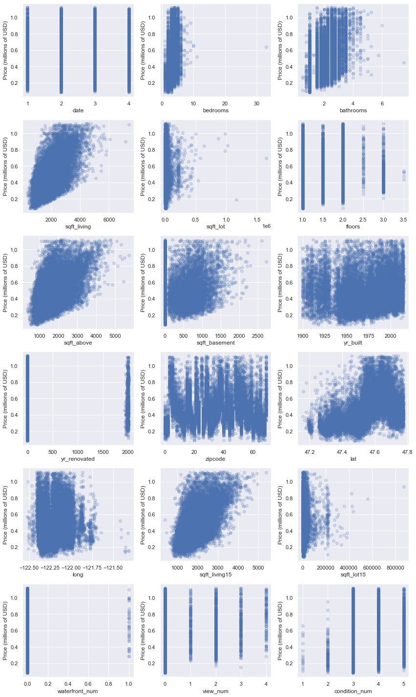
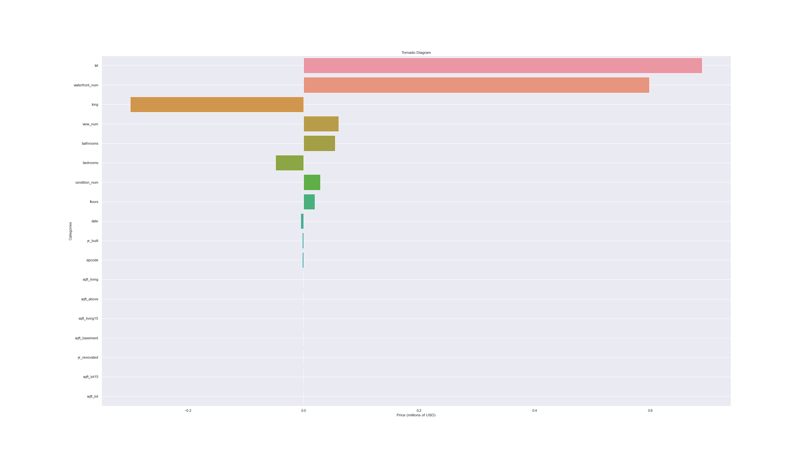

# Reynolds and Klein Appraisal

## Project Overview

The goal of this project is to use linear regression analysis of data on houses sold in King County so as to provide a final product to deliver to an apparaisal company (Reynolds and Klein). 

### Business Problem

Reynolds and Klein Appraisers has approached our company looking for a predictive solution in order to aid in their process. They are looking to predict the price of a house based on features from a dataset that they have provided us with (kc_house_data) which they downloaded from the King County assessor's website. They will utilize this solution in two areas of the business:

- Assist in training new employees on determining house prices in the market.
- Assist current employees in predicting house prices in areas of King County where they are unfamiliat with the micromarket

### Data

This project uses the King County House Sales dataset, which has been provided to us by the client from the King County Assessors office. Each of the 21597 data points indicates a house sale made in king county between 1970 and 2015. All of the column data in the dataset was used in the analysis, which can be seen at [column_names](data/column_names.md)

The house prices in the data range as per the following below

### Modeling

We used Linear Regression modeling to craft a model that would be suitable to provide to the client. 

We started by cleaning the data of nulls and odd inputs. The categorical data columns were converted to numeric data in order to be fed into our models. 

We then created 4 different models through statsmodel to determine what type of data manipulation works best according to the model coefficients and scores. These models ended up receiving the following R Squared results:

Model1 _ Initial Cleaned Data _ R Squared: 0.689

Model2 _ Lower and upper residuals removed _ R Squared: 0.654

Model3 _ Log Transform _ R Squared: 0.672

Model4 _ MinMax Scaling _ R Squared: 0.270

Based on the R squared and normality tests (Jarque Bera, and Omnibus), we used Model3 in our regression model. Prior to moving onto regression modeling, we explored our chosen dataset by plotting different aspects in order to get a good idea of what kind of data we are working with. We started with creating scatter plots to show each feature vs the house price:

Next we plot the correlation of each feature using a barplot. In plotting this we discovered that there are 5 categories which are the most strongly related to the price of a house. These include sqft_living, sqft_above, sqft_living15, latitude, and bathrooms.

Finally, we created a tornado diagram to show the change in price with each unit change in each of the categories

## Regression Results

We created three test train models in sklearn. Here is a brief overview of them:

Model Name _ type of regression _ features used _ train score _ test score

Baseline Model _ 1 degree polynomial model _ sqft_living _ 0.370 _ 0.350

Model_Poly3 _ 3 degree polynomial model _ all features _ 0.754 _ -20.1

Model_Poly2 _ 2 degree polynomial model _ all features _ 0.747 _ 0.734

### Conclusions

The second degree polynomial regression model really fit the data the best out of all our tested models. We were able to account for around 73.4 of the variance in the data itself, which would definitely be a good "goodness of fit" to present to the client. In addition, we know the accuracy is where is should be due to the normality scores received on the statsmodels. We should communication to the client that the model is not a fullproof way to determine the price of a house as by the end of our notebook, we see that our mean absolute error is $109,000 which is not ideal. There are other variables not present in the dataset that could affect this price. Given that, this model should work for their use case in training new employees and current employees.

If the client is looking for a more defined set, we can utlize methods detailed in the Next steps section to refine the model and minimize the error.

### Next Steps

If given more time the following could be pursued:

- Determine which houses the model does not account for currently, and determine what variables we can add in to account for these outliers.

- Release the model as a test model to Reynolds and Klein. After some testing, determine what they see that can be improved or what variables may be introduced into the model

- The sales of higher end houses have more variables that are involved in the sale due to the size of the home and the features being sold in the house. The next step could be to make a model for different tiers of houses being appraised

### For More Information

See full analysis in the [Jupyter Notebook](Notebook.ipynb) or review this [Reynolds-and-Klein_House-Appraisal-Predictions](Reynolds-and-Klein_House-Appraisal-Predictions.pdf)

For additional info, contact Tim Fuger at tfuger10@gmail.com

## Repository Navigation

In this repository you will find 5 files to take note of:

- [EDA_modeling_evaluation](EDA_modeling_evaluation.ipynb) contains all of the code for this project

- [kc_house_data](data/kc_house_data.csv) contains the data from King County Assessors office on about 21000 homes purchased in the king county area.

- [column_names](data/column_names.md) describes each of the columns in the kc_house_data dataset

- [images](images) folder contains all the images that are usedd in the markdown file

- [Reynolds-and-Klein_House-Appraisal-Predictions](presentation/Reynolds-and-Klein_House-Appraisal-Predictions.pptx) powerpoint file

- [Reynolds-and-Klein_House-Appraisal-Predictions](presentation/Reynolds-and-Klein_House-Appraisal-Predictions.pdf) pdf file
